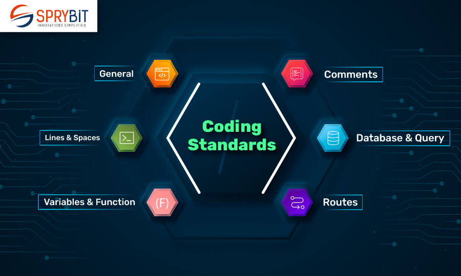

## What are Coding Standards?

  Coding standards are essential for all programmers to learn. These standards encompass a range of aspects, from basic formatting and documentation to integrating functions and handling errors.  Consistently following these sets of rules results in fewer bugs and performance issues. Clear coding standards enable programmers to create code that is both easy to understand and maintain on a personal and professional level. 
  When you think of coding standards, most people would instantly think of formatting, proper indentation, and syntax errors. However, most of it focuses on the content of the code itself. Implementing proper functions, conditionals, loops, arrays, etc, all serve different purposes while making the code more readable with better runtime performances. 

  

  

 

## Learning Potential

  When learning a new programming language, it is very easy to get confused with so many new built-in functions and concepts. If you tough it out, though, you will eventually grasp every concept much faster than without these practices built in. For example, in our ICS 314, when functional programming was introduced, there were a ton of new array functions we had to learn to implement in such a short amount of time. However, constantly doing WODs and doing homework assignments focusing on implementing array functions rather than loops helped me better get a grasp on what each function does.
  For instance, if you had to make a program that helped track runners' scores given by their judges, you might want  to use OOP to help you keep track of each runner’s score in a simple way. For example, you could define a runner class storing the names and scores of all runners along with functions like addScore(judge, score) to edit values simply through the console. Without putting these concepts into practice, you would just be juggling multiple arrays and unorganized data values that would likely not pass your test cases. 

## Thoughts on ESLint

  ESLint is a linting tool that helps analyze and auto-fix coding errors. The tool is most commonly used to catch unused variables, unreachable code, or implicit “any” types without a certain return type. It can also be used to point out actual formatting errors regarding double quotes, indentation, extra spaces, and new lines that can be added for clarity. This helps promote better formatting habits that meet coding standards while preventing more mistakes. 
  Personally, at first, I found ESLint to be quite a pain. I could not understand why I was getting so many errors at the beginning of many lines that I forgot to properly indent. However, after using it a bit more, I began to realize just how many bad habits I have picked up since I started coding. Picking up ESLint might be bothersome at first, having “random” errors constantly popping up. But now that I am more familiar with the coding standard rules, I believe that ESLint is a useful tool for any programmer to have on hand. Not only does it help fix many preventable errors, but it also helps programmers remember to follow coding standards to produce more uniform code. 

 
