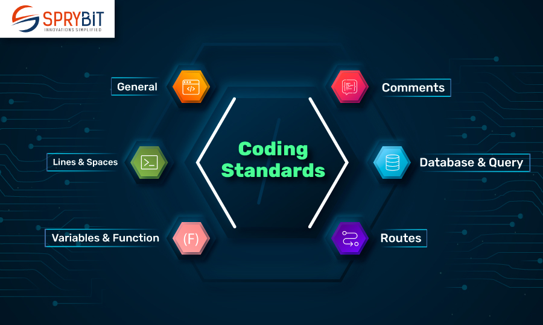

## What is a UI Framework?

  UI framework helps programmers develop interfaces in a more efficient way. It's basically a library of prebuilt building blocks that allow formatting simplicity. Style, components, and helpers, you name it, all of these can be simplified using UI framework. Once you take the time to learn it, you will most likely save a lot of time and brain power.

  

  

 

## Now What is Bootstrap?

  Bootstrap is one of the most popular HTML/CSS UI frameworks, it contains a utility class system and allows the user to better customize the formatting of their website. It contains ready-made components such as buttons, navbars, and dropdown menus, allowing the website to be more user-friendly and accessible. It also allows the options for fast responsive layouts, allowing programmers to align and center objects with inputs such as “mt-3” or “px-4”.

## Whats All the Hype About?

 Now, why do we need to learn bootstrap? I mean sure it might be faster but you can't do all said things within raw css and html itself? Bootstrap itself might take a little getting used to when you first start using it. I mean personally, I just learned it not that long ago and I’m still getting a hang of everything, but it feels way better to use. It is just consistent, for example, you have immediate access to scaling sizes, colors, and borders without even going to your CSS file. You also have access to grid utilities such as “col-”, “mt-*”, “justify-”, and “d-flex” that immediately allow you to rearrange everything on your website. You also get access to containers that make your layout more responsive across all brewers and devices. 
