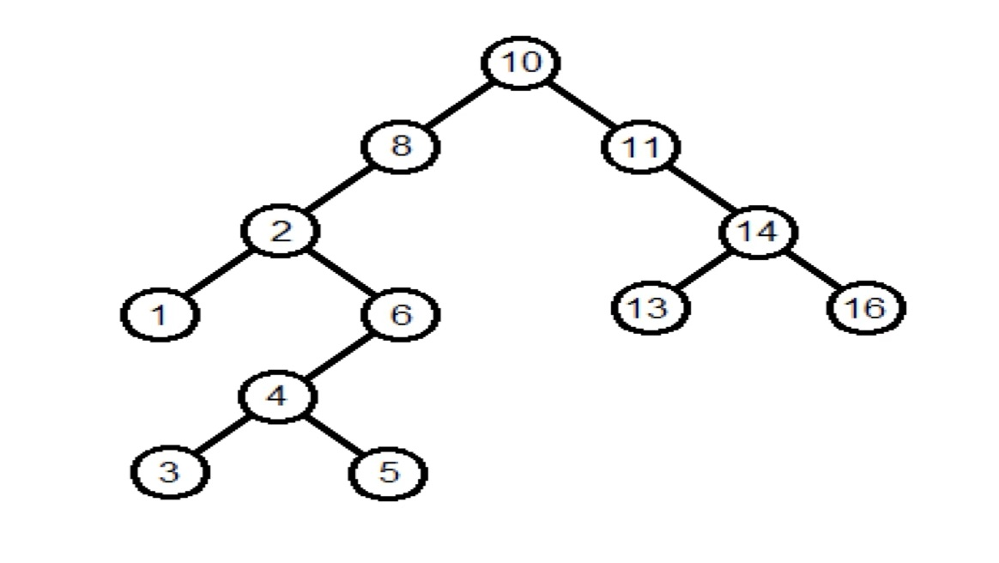

I created a binary search tree in C++ as part of a class in a previous semester.
In this project, I practiced using nodes and pointers to traverse through the tree
using recursion. 

  Through this assignment, I became more comfortable working with pointers and C++
in general. I learned the concept of allocating memory for new nodes, as well as
working with left and right pointers. Overall, this was probably my favorite project, 
as I was struggling a lot, and this helped me take more time to understand the
different concepts and data structures. 

