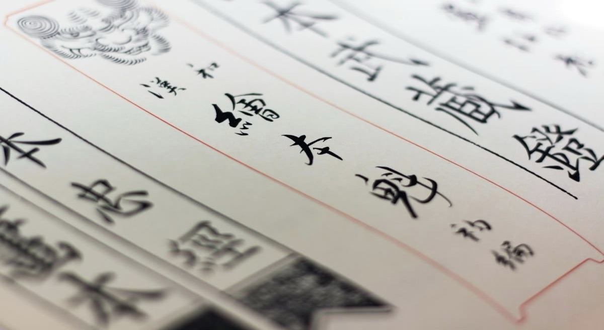

My personal reflection on learning a new language.

  In recent years, I have been studying Japanese, otherwise known as Nihongo, at UH Manoa.
Before these courses, my knowledge of Nihongo was nearly nonexistent. I had many attempts
to self-teach the language, but that was shortly cut off by a lack of motivation and discipline.
However, since my college admission, my motivation and drive to connect more with my
own culture have been stronger than ever.

  Through these courses, I learned various kanji and sentence structures that have improved
my knowledge tremendously. The oral tests really helped improve my communication skills and my
ability to hold a conversation in Nihongo. Today, I would say my understanding of the language
is pretty average. However, in future years, I'd like to strengthen my knowledge even more
to widen my social networks and possibly job opportunities.

