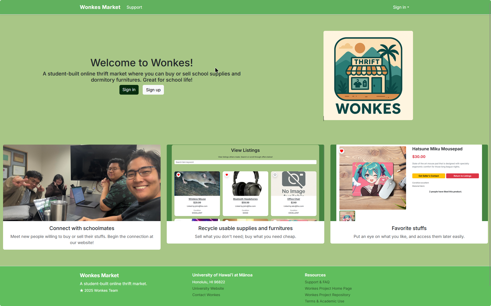

  

# The Project

Wonkes is a web-based marketplace application designed for University of Hawaiʻi at Mānoa (UHM) students. The purpose of the project is to provide a secure, student-focused platform where users can buy and sell items within the campus community. By limiting access to verified students, Wonkes helps reduce scams and makes peer-to-peer exchanges safer and more convenient.

The application allows users to browse listings, view item details, and interact with a clean and organized user interface. Wonkes emphasizes usability, accessibility, and a consistent design across all pages. The project was developed as part of the ICS 314 Software Engineering course and deployed online for public access.

## Contributions

My primary contribution to the Wonkes project was frontend development, with a specific focus on the Login and Sign-Up pages. I designed and implemented these pages using React, React-Bootstrap, and CSS, ensuring they were visually consistent with the rest of the application.

I worked on layout structure, form styling, input fields, and validation feedback to make the authentication process clear and user-friendly. I also focused on aligning components properly, improving spacing, and making the pages responsive across different screen sizes.

## Insights 

Working on the authentication pages helped me better understand the importance of user experience in frontend design. Since login and sign-up pages are often the first interaction users have with an application, clarity and simplicity are essential.

I also learned the value of breaking UI tasks into smaller steps, such as layout, styling, and validation, instead of attempting to build everything at once. This made debugging easier and improved overall progress

Wonkes is an internet marketplace application created specifically for students at the University of Hawai‘i at Mānoa. The idea behind this application is the development of a safe, student-centered platform that enables consumers within the university community to purchase or sell goods. Wonkes ensures the security of transactions by restricting the platform to registered university students.

The application enables users to browse listings, examine details of items, and engage with the user interface that is neat and well-organized. Wonkes focuses on ease of use, ease of access, and uniformity throughout all pages. The project was undertaken for the course ICS 314 Software Engineering and made available online.

You can find us here at these links:

- [Wonkes Website](https://wonkes.vercel.app/)
- [Our github.io Page](https://wonkes-manoa.github.io/)
